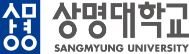

 

  
  
  <h3 align="center"> 상명대학교 컴퓨터과학과 과제 </h3>
  
  

    2015년도부터 2018년도까지의 상명대학교 컴퓨터과학과 과제 저장소
     
    <a href="https://github.com/HyunIm/Sangmyung_University"?<strong>저장소 살펴보기>></strong></a>
     
  

  
 목차 

  <ol>
    <li><a href="#2015년도-1학기">2015년도 1학기</a> (1학년 1학기)</li>
    <li><a href="#2015년도-2학기">2015년도 2학기</a> (1학년 2학기)</li>
    <li><a href="#2016년도-1학기">2016년도 1학기</a> (2학년 1학기)</li>
    <li><a href="#2016년도-2학기">2016년도 2학기</a> (2학년 2학기)</li>
    <li><a href="#2017년도-1학기">2017년도 1학기</a> (3학년 1학기)</li>
    <li><a href="#2017년도-2학기">2017년도 2학기</a> (3학년 2학기)</li>
    <li><a href="#2018년도-1학기">2018년도 1학기</a> (4학년 1학기)</li>
    <li><a href="#2018년도-2학기">2018년도 2학기</a> (4학년 2학기)</li>
  </ol>

## 2015년도 1학기
### [미적분학, 박종환 교수님](https://github.com/HyunIm/Sangmyung_University/tree/master/2015%EB%85%84%EB%8F%84%201%ED%95%99%EA%B8%B0/%EB%AF%B8%EC%A0%81%EB%B6%84%ED%95%99%2C%20%EB%B0%95%EC%A2%85%ED%99%98%20%EA%B5%90%EC%88%98%EB%8B%98) (Calculus)
전공 학문의 이해를 높이기 위한 기초학문으로서 함수에 대한 기본이론은 물론 함수의 극한, 도함수, 미분 및 적분에 대한 풀이방법에 대해 학습한다.

### [컴퓨터기초원리, 홍철의 교수님](https://github.com/HyunIm/Sangmyung_University/tree/master/2015%EB%85%84%EB%8F%84%201%ED%95%99%EA%B8%B0/%EC%BB%B4%ED%93%A8%ED%84%B0%EA%B8%B0%EC%B4%88%EC%9B%90%EB%A6%AC%2C%20%ED%99%8D%EC%B2%A0%EC%9D%98%20%EA%B5%90%EC%88%98%EB%8B%98) (Basic Principles of Computer Science)
본 과목은 컴퓨터 과학을 구성하는 다양한 기초 원리를 소개한다. 본 과목은 컴퓨터 과학을 전공하려는 학생들이 앞으로 배울 여러 기술적인 주제에 대하여 호기심과 흥미를 가질 수 있도록 설계되었다. 본 과목이 다루는 범위는 다음과 같다. 데이터와 수의 표현, 비트 연산, 컴퓨터 구성, 컴퓨터 네트워크, 운영체제, 알고리즘, 프로그래밍 언어, 소프트웨어 공학, 자료구조, 데이터 베이스, 보안, 계산 이론, 및 인공 지능.

(<a href="#top">맨 위로</a>)

## 2015년도 2학기
### [공학설계입문, 배경율 교수님](https://github.com/HyunIm/Sangmyung_University/tree/master/2015%EB%85%84%EB%8F%84%202%ED%95%99%EA%B8%B0/%EA%B3%B5%ED%95%99%EC%84%A4%EA%B3%84%EC%9E%85%EB%AC%B8%2C%20%EB%B0%B0%EA%B2%BD%EC%9C%A8%20%EA%B5%90%EC%88%98%EB%8B%98) (Introduction to Engineering Design)
설계의 본질과 공학의 주요 활동을 익히고 공학개념 설계의 절차와 정보획득 절차 및 설계관리 도구에 대하여 학습함으로써 공학도의 최소한의 소양을 갖추고 더 나아가 능력 있는 공학자의 자질을 배양

### [보안기초수학, 박종환 교수님](https://github.com/HyunIm/Sangmyung_University/tree/master/2015%EB%85%84%EB%8F%84%202%ED%95%99%EA%B8%B0/%EB%B3%B4%EC%95%88%EA%B8%B0%EC%B4%88%EC%88%98%ED%95%99%2C%20%EB%B0%95%EC%A2%85%ED%99%98%20%EA%B5%90%EC%88%98%EB%8B%98) (Number Theory)
본 과목은 정수론의 기본 개념들인 소수, 최대공약수, 합동, 원시근, 이차잉여류 등을 학습한다. 또한 학습한 개념들이 RSA, ElGamal 공개키 암호, DSA 등 현재 사용되는 다양한 암호기법을 설계하는데 어떻게 이용되는지 살펴볼 것이다.

### [프로그래밍I, 이의철 교수님](https://github.com/HyunIm/Sangmyung_University/tree/master/2015%EB%85%84%EB%8F%84%202%ED%95%99%EA%B8%B0/%ED%94%84%EB%A1%9C%EA%B7%B8%EB%9E%98%EB%B0%8DI%2C%20%EC%9D%B4%EC%9D%98%EC%B2%A0%20%EA%B5%90%EC%88%98%EB%8B%98) (Programming I)
본 과목은 C 언어를 사용하여 컴퓨터 프로그래밍의 기본 이론과 실기를 배우는 과목이다. 세부 내용은 C 언어의 숫자형, 문자형, 연산자, 제어용 문장, 배열, 프로그램의 구조, 포인터, 문자열, 구조형, 배열의 배열, 포인터의 배열, 파일 입출력 등이다. 본 과목에서 배운 내용은 실제 컴퓨터상에서 프로그래밍 하여 익힌다.

(<a href="#top">맨 위로</a>)

## 2016년도 1학기
### [논리회로, 민승욱 교수님](https://github.com/HyunIm/Sangmyung_University/tree/master/2016%EB%85%84%EB%8F%84%201%ED%95%99%EA%B8%B0/%EB%85%BC%EB%A6%AC%ED%9A%8C%EB%A1%9C%2C%20%EB%AF%BC%EC%8A%B9%EC%9A%B1%20%EA%B5%90%EC%88%98%EB%8B%98) (Logic Circuits)
컴퓨터 하드웨어의 기본을 이루는 부울연산 및 논리 게이트에 대해 학습하고 가산기, 다중화기 등의 조합회로와 레지스터, 카운터 및 메모리 소자 등의 순서회로에 대한 이해를 통해 컴퓨터 하드웨어 설계에 응용할 수 있는 능력을 배양한다.

### [선형대수학, 이의철 교수님](https://github.com/HyunIm/Sangmyung_University/tree/master/2016%EB%85%84%EB%8F%84%201%ED%95%99%EA%B8%B0/%EC%84%A0%ED%98%95%EB%8C%80%EC%88%98%ED%95%99%2C%20%EC%9D%B4%EC%9D%98%EC%B2%A0%20%EA%B5%90%EC%88%98%EB%8B%98) (Linear Algebra)
선형대수학은 우리에게 지식을 체계화시킬 수 있는 논리를 제공해준다. 그러나 이러한 논리적 사고 능력은 단순히 암기해서는 되지 않으며 단계별로 이해해 나가는 연습과정 중에 얻어지게 된다. 이러한 논리적 사고 능력의 배양과 함께 선형대수의 기본 개념들을 탐구하고 적용할 수 있는 능력의 개발이 본 교과목이 목표하는 바이다. 본 과목에서는 이론만을 다루지 않고 그래프 이론, 암호 이론, 마르코프 프로세스, 컴퓨터 그래픽, 피보나치수열, 데이터의 곡선적합 등 선형대수의 응용을 적절하게 다룬다.

### [시스템소프트웨어, 손성훈 교수님](https://github.com/HyunIm/Sangmyung_University/tree/master/2016%EB%85%84%EB%8F%84%201%ED%95%99%EA%B8%B0/%EC%8B%9C%EC%8A%A4%ED%85%9C%EC%86%8C%ED%94%84%ED%8A%B8%EC%9B%A8%EC%96%B4%2C%20%EC%86%90%EC%84%B1%ED%9B%88%20%EA%B5%90%EC%88%98%EB%8B%98) (System Softwares)
컴퓨터 소프트웨어는 응용 소프트웨어와 컴퓨터 시스템의 작동을 기본적으로 제어하는 시스템 소프트웨어로 나누어진다. 컴퓨터 하드웨어의 제어와 밀접한 관련이 있는 어셈블리 언어를 배우고, 어셈블리 언어를 기계어로 바꾸어주는 어셈블러를 설계 구현한다. 또한 오브젝트 모듈을 하나의 수행가능 한 파일로 만드는 링커와 기계어 프로그램을 메모리에 올려주는 로더 등의 시스템 소프트웨어의 기능과 구조를 배움으로서 컴퓨터 시스템의 작동 원리를 보다 심도 있게 이해한다.

### [이산수학, 김윤호 교수님](https://github.com/HyunIm/Sangmyung_University/tree/master/2016%EB%85%84%EB%8F%84%201%ED%95%99%EA%B8%B0/%EC%9D%B4%EC%82%B0%EC%88%98%ED%95%99%2C%20%EA%B9%80%EC%9C%A4%ED%98%B8%20%EA%B5%90%EC%88%98%EB%8B%98) (Discrete Mathematics)
자료의 정리와 배열에 관한 집합이론과 자료사이의 인과관계를 다루는 논리구조와 확률의 개념, 귀납법 및 순환법을 통해 주어진 문제를 논리적이고 오류없이 해결하는 방법을 배우며, 조합론 및 이산구조, 알고리즘 분석 등 다른 전공과목을 이해하는데 필요한 기초지식을 습득한다.

### [프로그래밍2, 홍철의 교수님](https://github.com/HyunIm/Sangmyung_University/tree/master/2016%EB%85%84%EB%8F%84%201%ED%95%99%EA%B8%B0/%ED%94%84%EB%A1%9C%EA%B7%B8%EB%9E%98%EB%B0%8D2%2C%20%ED%99%8D%EC%B2%A0%EC%9D%98%20%EA%B5%90%EC%88%98%EB%8B%98) (Programming II)
본 과목은 C 언어를 사용하여 컴퓨터 프로그래밍의 기본 이론과 실기를 배우는 과목이다. 세부 내용은 C 언어의 숫자형, 문자형, 연산자, 제어용 문장, 배열, 프로그램의 구조, 포인터, 문자열, 구조형, 배열의 배열, 포인터의 배열, 파일 입출력 등이다. 본 과목에서 배운 내용은 실제 컴퓨터상에서 프로그래밍 하여 익힌다.

(<a href="#top">맨 위로</a>)

## 2016년도 2학기
### [객체지향프로그래밍, 김영준 교수님](https://github.com/HyunIm/Sangmyung_University/tree/master/2016%EB%85%84%EB%8F%84%202%ED%95%99%EA%B8%B0/%EA%B0%9D%EC%B2%B4%EC%A7%80%ED%96%A5%ED%94%84%EB%A1%9C%EA%B7%B8%EB%9E%98%EB%B0%8D%2C%20%EA%B9%80%EC%98%81%EC%A4%80%20%EA%B5%90%EC%88%98%EB%8B%98) (Object Oriented Programming)
객체지향 분석, 설계 및 프로그래밍에 대한 개념과 다양한 객체지향 프로그래밍 언어의 특징과 기본을 배운다. 이를 통하여 객체지향 소프트웨어 시스템을 직접 개발하여 봄으로써 객체지향 패러다임을 이해하게 되며 객체지향 개념을 이용할 수 있는 소양을 쌓는다.

### [데이터통신, 정진우 교수님](https://github.com/HyunIm/Sangmyung_University/tree/master/2016%EB%85%84%EB%8F%84%202%ED%95%99%EA%B8%B0/%EB%8D%B0%EC%9D%B4%ED%84%B0%ED%86%B5%EC%8B%A0%2C%20%EC%A0%95%EC%A7%84%EC%9A%B0%20%EA%B5%90%EC%88%98%EB%8B%98) (Data Communication)
대표적인 인터네트워킹 기술인 TCP/IP 프로토콜과 웹에 근간이 되는 다양한 프로토콜의 내부 구조와 구현 기술에 대하여 연구하며 공부한다. 또한 소켓 인터페이스를 이용하여 다양한 응용 프로토콜을 설계 구현할 수 있는 능력을 배양한다.

### [운영체제, 손성훈 교수님](https://github.com/HyunIm/Sangmyung_University/tree/master/2016%EB%85%84%EB%8F%84%202%ED%95%99%EA%B8%B0/%EC%9A%B4%EC%98%81%EC%B2%B4%EC%A0%9C%2C%20%EC%86%90%EC%84%B1%ED%9B%88%20%EA%B5%90%EC%88%98%EB%8B%98) (Operating Systems)
운영체제는 사용자의 편리한 컴퓨터 사용을 도와주고 컴퓨터 시스템의 자원을 효율적으로 사용하도록 관리하는 중요한 시스템 소프트웨어이다. 관리해야 할 컴퓨터 시스템의 특성, 운영체제의 요건 등과 프로세스, 메모리, 파일시스템, 입출력시스템 등에 대한 설계 원리와 구현에 대하여 학습한다.

### [자료구조, 홍철의 교수님](https://github.com/HyunIm/Sangmyung_University/tree/master/2016%EB%85%84%EB%8F%84%202%ED%95%99%EA%B8%B0/%EC%9E%90%EB%A3%8C%EA%B5%AC%EC%A1%B0%2C%20%ED%99%8D%EC%B2%A0%EC%9D%98%20%EA%B5%90%EC%88%98%EB%8B%98) (Data Structures)
본 과목에서는 효과적인 컴퓨터 소프트웨어 설계를 위하여 필수적인 자료의 표현 및 처리 방법을 다룬다. 주된 내용은 자료구조와 알고리즘의 개념을 이해하고 다양한 자료구조인 배열, 스택, 큐, 리스트, 트리, 그래프 등의 개념 및 각각의 자료구조와 관련된 기본 알고리즘을 다룬다.

### [컴퓨터구조, 김성철 교수님](https://github.com/HyunIm/Sangmyung_University/tree/master/2016%EB%85%84%EB%8F%84%202%ED%95%99%EA%B8%B0/%EC%BB%B4%ED%93%A8%ED%84%B0%EA%B5%AC%EC%A1%B0%2C%20%EA%B9%80%EC%84%B1%EC%B2%A0%20%EA%B5%90%EC%88%98%EB%8B%98) (Computer Architecture)
컴퓨터의 구성 요소인 중앙 처리 장치(CPU), 명령어 세트, 성능 향상을 위한 파이프라인 방식의 이해, 메인 메모리, 캐쉬 메모리의 특성과 외부 메모리, 그리고 시스템 버스 및 입출력 장치 등 컴퓨터 구조의 전반적인 개념을 이해한다.

(<a href="#top">맨 위로</a>)

## 2017년도 1학기
### [데이터베이스, 송병호 교수님](https://github.com/HyunIm/Sangmyung_University/tree/master/2017%EB%85%84%EB%8F%84%201%ED%95%99%EA%B8%B0/%EB%8D%B0%EC%9D%B4%ED%84%B0%EB%B2%A0%EC%9D%B4%EC%8A%A4%2C%20%EC%86%A1%EB%B3%91%ED%98%B8%20%EA%B5%90%EC%88%98%EB%8B%98) (Database)
실세계의 다양한 정보원들을 조직화하여 통합 저장하는 데이터베이스와 이를 중앙 관리하는 데이터베이스 관리 시스템 및 관련 이론과 기술을 배운다. 관계 데이터 모델을 기반으로 하여 관계 대수와 해석, 관계 질의어인 SQL과 QBE, 데이터베이스 설계의 대강, 데이터 종속성과 정규화 이론을 중점적으로 학습하며 데이터 마이닝이나 트랜잭션 처리, 인터넷 데이터베이스 등을 보조적으로 학습하며 최신 응용분야에 활용할 수 있는 안목을 기른다.

### [소프트웨어공학, 한혁수 교수님](https://github.com/HyunIm/Sangmyung_University/tree/master/2017%EB%85%84%EB%8F%84%201%ED%95%99%EA%B8%B0/%EC%86%8C%ED%94%84%ED%8A%B8%EC%9B%A8%EC%96%B4%EA%B3%B5%ED%95%99%2C%20%ED%95%9C%ED%98%81%EC%88%98%20%EA%B5%90%EC%88%98%EB%8B%98) (Software Engineering)
소프트웨어 공학은 소프트웨어 개발을 위한 구조화된 방법을 강의하는 과목이다. 요구사항 분석부터 유지보수까지 연구된 이론들을 살펴보고, 계별로 최신 관련 연구를 통해 현재의 연구 방향을 이해한다. 이러한 이론을 바탕으로 체계적인 방법을 통해 소프트웨어를 개발해 내도록 교육한다.

### [알고리즘, 홍철의 교수님](https://github.com/HyunIm/Sangmyung_University/tree/master/2017%EB%85%84%EB%8F%84%201%ED%95%99%EA%B8%B0/%EC%95%8C%EA%B3%A0%EB%A6%AC%EC%A6%98%2C%20%ED%99%8D%EC%B2%A0%EC%9D%98%20%EA%B5%90%EC%88%98%EB%8B%98) (Algorithm)
컴퓨터를 사용하여 주어진 문제를 풀고 해답을 얻어내는 과정을 기술한 것을 알고리즘이라고 한다. 본 강좌에서는 정렬 문제와 트리 및 그래프로 추상화된 문제들에 대한 여러 알고리즘을 공부하고 각 알고리즘들의 시간적 공간적 측면의 효율을 비교하고 분석하는 기법을 배운다.

### [유닉스프로그래밍, 백윤철 교수님](https://github.com/HyunIm/Sangmyung_University/tree/master/2017%EB%85%84%EB%8F%84%201%ED%95%99%EA%B8%B0/%EC%9C%A0%EB%8B%89%EC%8A%A4%ED%94%84%EB%A1%9C%EA%B7%B8%EB%9E%98%EB%B0%8D%2C%20%EB%B0%B1%EC%9C%A4%EC%B2%A0%20%EA%B5%90%EC%88%98%EB%8B%98) (UNIX Programming)
본 과목은 C 언어와 유닉스 시스템 호출 인터페이스를 사용한 프로그래밍 방법을 공부한다. 세부적인 기술 사항은 다음과 같다. 쉘(shell), 파일 입출력, 파일 및 디렉토리, 시스템 데이터 파일 및 정보, 프로세스 환경, 프로세스 제어, 소켓(socket), 신호(signal), 쓰레드(thread), 프로세스 간 통신(IPC) 등이다. 또한 이 과목에서는 공학 설계 및 컴퓨터 윤리를 다룬다.

### [인공지능, 김영준 교수님](https://github.com/HyunIm/Sangmyung_University/tree/master/2017%EB%85%84%EB%8F%84%201%ED%95%99%EA%B8%B0/%EC%9D%B8%EA%B3%B5%EC%A7%80%EB%8A%A5%2C%20%EA%B9%80%EC%98%81%EC%A4%80%20%EA%B5%90%EC%88%98%EB%8B%98) (Artificial Intelligence)
인공지능과 관련된 기본 이론과 다양한 응용 방법을 다룬다. 특히 탐색 방법, 다양한 지식 표현 방법, 추론법, LISP와 PROLOG 등의 인공지능 언어 등에 대한 지식을 습득하고 지식 기반 시스템의 원리 및 구성 방법 등을 배운다.

### [컴퓨터네트워크, 김성철 교수님](https://github.com/HyunIm/Sangmyung_University/tree/master/2017%EB%85%84%EB%8F%84%201%ED%95%99%EA%B8%B0/%EC%BB%B4%ED%93%A8%ED%84%B0%EB%84%A4%ED%8A%B8%EC%9B%8C%ED%81%AC%2C%20%EA%B9%80%EC%84%B1%EC%B2%A0%20%EA%B5%90%EC%88%98%EB%8B%98) (Computer Networks)
인터넷 프로토콜 스텍의 HTTP, FTP와 같은 어플리케이션 계층 프로토콜, TCP와 UDP의 트랜스포트 계층 프로토콜, IP 네트워크 계층 프로토콜 및 이더넷, ATM 등의 데이터링크 계층에서의 프로토콜들에 대한 이해와 인터넷에서의 트래픽 전송 특성 등에 대해 이해한다.

(<a href="#top">맨 위로</a>)

## 2017년도 2학기
### [게임소프트웨어디자인1, 김석규 교수님](https://github.com/HyunIm/Sangmyung_University/tree/master/2017%EB%85%84%EB%8F%84%202%ED%95%99%EA%B8%B0/%EA%B2%8C%EC%9E%84%EC%86%8C%ED%94%84%ED%8A%B8%EC%9B%A8%EC%96%B4%EB%94%94%EC%9E%90%EC%9D%B81%2C%20%EA%B9%80%EC%84%9D%EA%B7%9C%20%EA%B5%90%EC%88%98%EB%8B%98) (Game Software Design I)
본 교과목은 게임제작의 기초이론을 바탕으로 게임 시스템을 기획 및 설계하고 게임제작에 대한 전반적인 기술 및 전문용어 등을 습득하여 실무에 적용 가능한 심층적인 학습을 제공한다.

### [디지털신호처리, 이의철 교수님](https://github.com/HyunIm/Sangmyung_University/tree/master/2017%EB%85%84%EB%8F%84%202%ED%95%99%EA%B8%B0/%EB%94%94%EC%A7%80%ED%84%B8%EC%8B%A0%ED%98%B8%EC%B2%98%EB%A6%AC%2C%20%EC%9D%B4%EC%9D%98%EC%B2%A0%20%EA%B5%90%EC%88%98%EB%8B%98) (Computer Graphics)
디지털신호의 기본 개념과 프로그래밍 언어를 통해 디지털 신호 및 영상으로부터 패턴인식을 위해 필요한 특징벡터 추출 방법을 학습한다. 이를 위해 디지털신호의 산술연산, 컨볼루션 연산, 기하학적 처리등의 시간 및 공간 영역에서의 처리기법과 퓨리에 변환에 기반한 주파수 영역에서의 처리방법을 학습한다.

### [프로그래밍언어론, 신동하 교수님](https://github.com/HyunIm/Sangmyung_University/tree/master/2017%EB%85%84%EB%8F%84%202%ED%95%99%EA%B8%B0/%ED%94%84%EB%A1%9C%EA%B7%B8%EB%9E%98%EB%B0%8D%EC%96%B8%EC%96%B4%EB%A1%A0%2C%20%EC%8B%A0%EB%8F%99%ED%95%98%20%EA%B5%90%EC%88%98%EB%8B%98) (Theory of Programming Languages)
본 과목은 프로그래밍 언어의 기본 이론을 소개한다. 먼저 귀납법(induction), 문맥 자유 문법(context-free grammar), 파싱(parsing) 등의 형식적(formal) 이론을 소개한 후 다양한 언어의 실제적인 의미(semantics)에 대하여 공부한다. 본 과목에서 다루는 자세한 내용은 귀납법, 문맥 자유 문법, 파싱, 식(expression) 중심 언어, 상태(state) 중심 언어, 형(type) 중심 언어, 객체(object) 중심 언어 등의 의미를 포함하고 있다. 본 과목에서 학생들은 여러 언어의 인터프리터를 구현해 봄으로서 배운 이론을 연습한다.

### [휴먼컴퓨터인터렉션, 한혁수 교수님](https://github.com/HyunIm/Sangmyung_University/tree/master/2017%EB%85%84%EB%8F%84%202%ED%95%99%EA%B8%B0/%ED%9C%B4%EB%A8%BC%EC%BB%B4%ED%93%A8%ED%84%B0%EC%9D%B8%ED%84%B0%EB%A0%89%EC%85%98%2C%20%ED%95%9C%ED%98%81%EC%88%98%20%EA%B5%90%EC%88%98%EB%8B%98) (Human Computer Interaction)
소프트웨어를 개발하는 프로그래머들에게 여러 인터페이스 개발 방법들을 소개하고, 이 방법들을 적용 분야와 적용 목적에 따라 그 차이를 비교함으로서 보다 편리한 인터페이스를 개발하는 방법을 학습한다. 또한 소프트웨어들이 지금까지 사용해 왔던 방법들을 살펴보고 사용자 측면에서 문제점을 알아봄으로써 보다 효과적인 인터페이스 설계를 할 수 있도록 하는데 목적이 있다.

(<a href="#top">맨 위로</a>)

## 2018년도 1학기
### [미적분학, 이석필 교수님](https://github.com/HyunIm/Sangmyung_University/tree/master/2018%EB%85%84%EB%8F%84%201%ED%95%99%EA%B8%B0/%EB%AF%B8%EC%A0%81%EB%B6%84%ED%95%99%2C%20%EC%9D%B4%EC%84%9D%ED%95%84%20%EA%B5%90%EC%88%98%EB%8B%98) (Calculus)
전공 학문의 이해를 높이기 위한 기초학문으로서 함수에 대한 기본이론은 물론 함수의 극한, 도함수, 미분 및 적분에 대한 풀이방법에 대해 학습한다.

### [보안프로그래밍, 강상욱 교수님](https://github.com/HyunIm/Sangmyung_University/tree/master/2018%EB%85%84%EB%8F%84%201%ED%95%99%EA%B8%B0/%EB%B3%B4%EC%95%88%ED%94%84%EB%A1%9C%EA%B7%B8%EB%9E%98%EB%B0%8D%2C%20%EA%B0%95%EC%83%81%EC%9A%B1%20%EA%B5%90%EC%88%98%EB%8B%98) (Secure Programming)
본 과목은 안전한 프로그래밍을 위한 다음과 같은 기술을 공부한다. 안전 프로그래밍 문제, 프로그램 정적 분석, 타입 검사, 입력의 처리 방법, 버퍼 오버플로, 오류 및 예외 처리, 안전 프로그래밍 언어, 웹 응용, HTTP 응용, XML 및 웹 응용.

### [임베디드소프트웨어I, 신동하 교수님](https://github.com/HyunIm/Sangmyung_University/tree/master/2018%EB%85%84%EB%8F%84%201%ED%95%99%EA%B8%B0/%EC%9E%84%EB%B2%A0%EB%94%94%EB%93%9C%EC%86%8C%ED%94%84%ED%8A%B8%EC%9B%A8%EC%96%B4%20I%2C%20%EC%8B%A0%EB%8F%99%ED%95%98%20%EA%B5%90%EC%88%98%EB%8B%98) (Embedded Software I)
본 과목은 임베디드 소프트웨어 개발을 위한 ARM 구조와 실시간 커널을 소개한다. 본 과목에서 공부하는 기술은 다음과 같다. ARM 구조 기초, ARM 어셈블리 프로그래밍, ELF 구조, 개발 환경, 디바이스 프로그래밍, 예외 프로그래밍, 타이머 인터럽트 프로그래밍, 실시간 시스템 개념, 실시간 커널의 구조, 태스크 관리, 시간 관리, 이벤트 관리, 세마포 관리, 메모리 관리 등이다. 본 과목에서 학생들은 ARM 개발 키트 상에서 배운 기술을 연습하는 다양한 프로그래밍 실습을 수행한다.

### [캡스톤디자인I, 한혁수 교수님](https://github.com/HyunIm/Sangmyung_University/tree/master/2018%EB%85%84%EB%8F%84%201%ED%95%99%EA%B8%B0/%EC%BA%A1%EC%8A%A4%ED%86%A4%EB%94%94%EC%9E%90%EC%9D%B8I%2C%20%ED%95%9C%ED%98%81%EC%88%98%20%EA%B5%90%EC%88%98%EB%8B%98) (Capstone Design I)
소프트웨어 개발의 중요한 단계들인 계획, 분석, 설계, 구현, 테스트, 유지보수 과정을 효과적으로 수행하기 위한 기법을 배우고 이를 직접 팀을 구성하여 프로젝트에 적용시켜봄으로써 적은 비용으로 품질 높은 소프트웨어를 개발하는 능력과 실무 응용력, 문제 해결능력을 기른다.

### [컴파일러, 신동하 교수님](https://github.com/HyunIm/Sangmyung_University/tree/master/2018%EB%85%84%EB%8F%84%201%ED%95%99%EA%B8%B0/%EC%BB%B4%ED%8C%8C%EC%9D%BC%EB%9F%AC%2C%20%EC%8B%A0%EB%8F%99%ED%95%98%20%EA%B5%90%EC%88%98%EB%8B%98) (Compilers)
본 과목은 고급(high level) 언어를 저급(low level) 언어로 변환하는 컴파일러를 개발하는 데 필요한 기본 기술을 소개한다. 본 과목에서 다루는 기술적인 사항은 다음과 같다. 정규 식(regular expression), 유한 자동 기계(finite automata), 정규 언어(regular languages), flex 컴파일러 도구, 문맥 자유 문법(context-free grammar), 푸시 다운 자동 기계(push-down automata), 문맥 자유 언어(context-free language), 하향식 파싱(top-down parsing), 상향식 파싱(bottom-up parsing), bison 컴파일러 도구, 속성 문법(attribute grammar), 심볼 테이블, 타겟 기계, 실행 시간 환경, 코드 생성 등이다. 본 과목에서 학생들은 작은 C 언어의 컴파일러를 직접 구현해 봄으로서 컴파일러 개발 기술을 연습한다.

### [통계, 유훈 교수님](https://github.com/HyunIm/Sangmyung_University/tree/master/2018%EB%85%84%EB%8F%84%201%ED%95%99%EA%B8%B0/%ED%86%B5%EA%B3%84%2C%20%EC%9C%A0%ED%9B%88%20%EA%B5%90%EC%88%98%EB%8B%98) (Statistics)
확률변수를 이해하고, 통계적인 해석 기법을 익히기 위한 기본적인 내용을 학습한다. 또한 멀티미디어 신호 (영상 및 음향)와 같은 전자 신호의 특성을 응용분야로 이해한다.

(<a href="#top">맨 위로</a>)

## 2018년도 2학기
### [인공지능 사회, 권지은 교수님](https://github.com/HyunIm/Sangmyung_University/tree/master/2018%EB%85%84%EB%8F%84%202%ED%95%99%EA%B8%B0/%EC%9D%B8%EA%B3%B5%EC%A7%80%EB%8A%A5%EC%82%AC%ED%9A%8C%2C%20%EA%B6%8C%EC%A7%80%EC%9D%80%20%EA%B5%90%EC%88%98%EB%8B%98) (Artificial Intelligence Society)
본 수업은 4차 산업혁명 기반 인공지능에 대한 논리와 기술을 이해하고 사회 트랜드와 미래 사회 등에 대한 지식을 배양한다. 인공지능 기술을 구현하기 위한 기본 컨셉과 개념을 이해할 수 있도록 한다. 다양한 Case study를 분석하고, 인간과 컴퓨터의 본질적인 관계와 지능사회 및 환경에 대한 특징을 학습한다.

### [캡스톤디자인II, 한혁수 교수님](https://github.com/HyunIm/Sangmyung_University/tree/master/2018%EB%85%84%EB%8F%84%202%ED%95%99%EA%B8%B0/%EC%BA%A1%EC%8A%A4%ED%86%A4%EB%94%94%EC%9E%90%EC%9D%B8II%2C%20%ED%95%9C%ED%98%81%EC%88%98%20%EA%B5%90%EC%88%98%EB%8B%98) (Capstone Design2)
소프트웨어 개발의 중요한 단계들인 계획, 분석, 설계, 구현, 테스트, 유지보수 과정을 효과적으로 수행하기 위한 기법을 배우고 이를 직접 팀을 구성하여 프로젝트에 적용시켜봄으로써 적은 비용으로 품질 높은 소프트웨어를 개발하는 능력과 실무 응용력, 문제 해결능력을 기른다.

(<a href="#top">맨 위로</a>)

